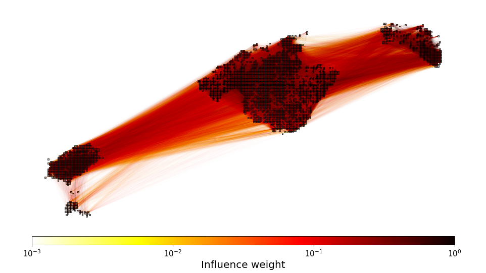
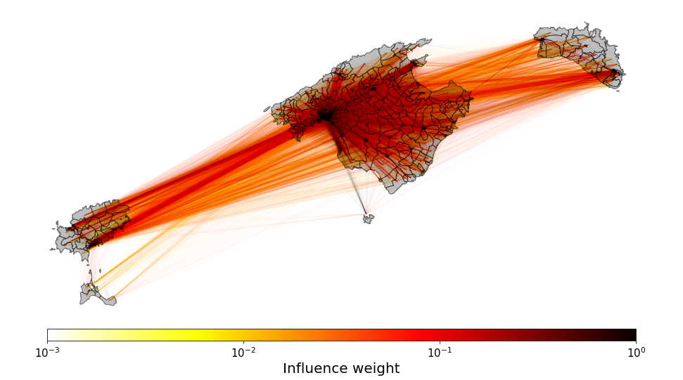
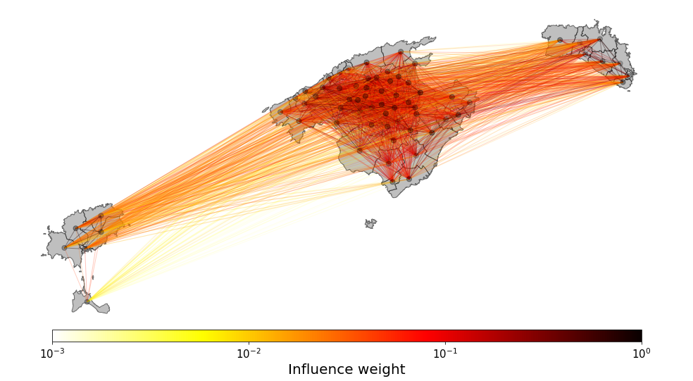

## Data and materials for "Exploring the spatial segmentation of housing markets from online listings"

This folder contains the materials from the publication: "Exploring the spatial segmentation of housing markets from online listings". The full dataset containing all the networks is in ZENODO folder, in the following link: 

It includes the weighted networks of spatial units, where the link between two spatial units account not only for the presence of common real estate agencies operating in both units but also its influence, accounting for the relative share of those agencies in that spatial units.

We construct the networks using 3 different spatial units: 1000 m square grid cells, municipalities and census tracts. 

### Networks using $1000$ $\times$ $1000$ $m^2$ square cells as spatial units:

    

    

### Networks using Census-tracts as spatial units:

    

    

### Networks using Municipalities as spatial units:

    

    

